# JavaRedAlert2 项目文档

> 最后更新：2026-01-17 11:20:17
> 初始化架构：AI 自适应文档生成系统

---

## 变更记录 (Changelog)

### 2026-01-17 11:20:17
- 初始化项目 AI 上下文文档
- 完成全仓清点与模块识别
- 生成根级与模块级文档结构
- 建立 Mermaid 模块结构图

---

## 项目愿景

JavaRedAlert2 是一个用 Java 复刻《红色警戒2》的开源项目，由 @Charlie-Skywalker 发起。项目旨在通过纯 Java 实现 RTS 游戏的核心机制，包括单位渲染、地图编辑、建筑建造、战斗系统等经典红警2特性。

**核心目标：**
- 完整复刻红警2的游戏机制
- 支持地图编辑器与随机地图生成
- 实现基于 OpenGL 的高性能渲染
- 提供可扩展的架构支持社区二次开发

---

## 架构总览

### 技术栈
- **语言**：Java 8 (JDK 1.8)
- **构建工具**：Maven 3.x
- **渲染引擎**：JOGL (Java OpenGL) + Swing AWT
- **音频**：WAV 文件直接播放
- **资源格式**：
  - SHP (Sprite 图形)
  - PAL (调色板)
  - TEM/URB/SNO (地形瓦片)
  - WAV (音效)

### 核心架构
项目采用 **事件驱动 + 帧动画循环** 架构：

```
┌─────────────────────────────────────────────────────────┐
│                    主线程 (AWT Event)                    │
│  - UI 事件处理 (鼠标/键盘)                                │
│  - 界面更新与重绘                                        │
└─────────────────────────────────────────────────────────┘
                         ↓
┌─────────────────────────────────────────────────────────┐
│              渲染线程 (MainPanel)                        │
│  - 基于 OpenGL / Java2D 渲染                            │
│  - 60 FPS 持续重绘                                      │
│  - 按优先级排序绘制 ShapeUnit                            │
└─────────────────────────────────────────────────────────┘
                         ↓
┌─────────────────────────────────────────────────────────┐
│         帧计算线程池 (ShapeUnitCalculateTask)            │
│  - 计算所有单位的下一帧动画                              │
│  - 处理移动、攻击、建造等逻辑                            │
│  - 15 FPS 建筑动画 (frameSpeed=4)                       │
└─────────────────────────────────────────────────────────┘
                         ↓
┌─────────────────────────────────────────────────────────┐
│            事件管理器 (EventHandlerManager)              │
│  - 建造事件 (ConstructEvent)                            │
│  - 图标点击事件 (ConstIconClickEvent)                    │
│  - 自定义红警事件 (RaEvent)                              │
└─────────────────────────────────────────────────────────┘
```

---

## 模块结构图

```mermaid
graph TD
    ROOT["(根) JavaRedAlert2"]

    ROOT --> CORE["核心层 (core)"]
    ROOT --> SHAPE["形状对象层 (shapeObjects)"]
    ROOT --> MILITARY["军事建筑层 (militaryBuildings)"]
    ROOT --> MAPEDITOR["地图编辑器 (mapEditor)"]
    ROOT --> UI["用户界面 (ui/tabIcon)"]
    ROOT --> UTILS["工具类 (utils/utilBean)"]
    ROOT --> EVENT["事件系统 (event)"]
    ROOT --> RESOURCE["资源中心 (resourceCenter)"]
    ROOT --> ENUMS["枚举定义 (enums)"]
    ROOT --> OTHER["其他组件 (other)"]

    CORE --> MAIN["MainTest (入口)"]
    CORE --> PANEL["MainPanel (渲染)"]
    CORE --> CTOR["Constructor (建造)"]
    CORE --> CTXT["GameContext (上下文)"]

    SHAPE --> BASE["ShapeUnit (基类)"]
    SHAPE --> BUILDING["Building (建筑)"]
    SHAPE --> VEHICLE["Vehicle (载具)"]
    SHAPE --> SOLDIER["Soldier (步兵)"]

    MILITARY --> ALLY["盟军建筑 (Af*)"]
    MILITARY --> SOVIET["苏军建筑 (Sf*)"]

    MAPEDITOR --> EDITOR["MapEditorPanel"]
    MAPEDITOR --> TERRAIN["地形系统"]
    MAPEDITOR --> GENERATOR["地图生成器"]

    click MAPEDITOR "./src/main/java/redAlert/mapEditor/CLAUDE.md" "查看地图编辑器文档"

    UTILS --> POINT["坐标系统"]
    UTILS --> SHPREADER["SHP 读取"]
    UTILS --> MOVE["寻路系统"]

    EVENT --> HANDLER["EventHandlerManager"]
    EVENT --> CONSTRUCT["建造事件"]
    EVENT --> CLICK["图标点击"]

    RESOURCE --> SHAPECENTER["ShapeUnitResourceCenter"]
    RESOURCE --> SHPCENTER["ShpResourceCenter"]

    ENUMS --> COLOR["UnitColor"]
    ENUMS --> TERRAINTYPE["TerrainType"]
    ENUMS --> CONSTCONFIG["ConstConfig"]

    OTHER --> BLOODBAR["血条显示"]
    OTHER --> MOUSE["鼠标系统"]
    OTHER --> NUCLEAR["核弹动画"]
```



---

## 模块索引

| 模块路径 | 职责描述 | 关键类 | 入口点 | 文档链接 |
|---------|---------|--------|--------|---------|
| `redAlert.core` | 游戏核心与启动 | `MainTest`, `MainPanel`, `GameContext` | `MainTest.main()` | [查看详情](./src/main/java/redAlert/CLAUDE.md) |
| `redAlert.shapeObjects` | 可渲染对象抽象 | `ShapeUnit`, `Building`, `Vehicle`, `Soldier` | `ShapeUnit` | [查看详情](./src/main/java/redAlert/shapeObjects/CLAUDE.md) |
| `redAlert.militaryBuildings` | 军事建筑实现 | `AfCnst`, `AfPowr`, `SfMisl` 等 | `Building` | [查看详情](./src/main/java/redAlert/militaryBuildings/CLAUDE.md) |
| `redAlert.mapEditor` | 地图编辑与生成 | `MapEditorPanel`, `RandomMapGenerate`, `Tile` | `MapEditorTest` | [查看详情](./src/main/java/redAlert/mapEditor/CLAUDE.md) |
| `redAlert.ui` | 用户界面组件 | `OptionsPanel`, `PowerPanel`, `RadarLabel` | `OptionsPanel` | [查看详情](./src/main/java/redAlert/ui/CLAUDE.md) |
| `redAlert.tabIcon` | 建造图标系统 | `Tab00Manager`, `AfCnstConstBtn` 等 | `Tab00Manager` | [查看详情](./src/main/java/redAlert/tabIcon/CLAUDE.md) |
| `redAlert.utils` | 工具类集合 | `PointUtil`, `ShpFileReader`, `CanvasPainter` | - | [查看详情](./src/main/java/redAlert/utils/CLAUDE.md) |
| `redAlert.utilBean` | 核心数据结构 | `CenterPoint`, `XunLuBean`, `MovePlan` | `CenterPoint` | [查看详情](./src/main/java/redAlert/utilBean/CLAUDE.md) |
| `redAlert.event` | 事件系统 | `EventHandlerManager`, `ConstructEvent` | `EventHandlerManager.init()` | [查看详情](./src/main/java/redAlert/event/CLAUDE.md) |
| `redAlert.resourceCenter` | 资源管理与缓存 | `ShapeUnitResourceCenter`, `ShpResourceCenter` | `ShpResourceCenter` | [查看详情](./src/main/java/redAlert/resourceCenter/CLAUDE.md) |
| `redAlert.enums` | 枚举定义 | `UnitColor`, `TerrainType`, `ConstConfig` | - | [查看详情](./src/main/java/redAlert/enums/CLAUDE.md) |
| `redAlert.other` | 辅助组件 | `BloodBar`, `Mouse`, `NuclearBombUp` 等 | - | [查看详情](./src/main/java/redAlert/other/CLAUDE.md) |

---

## 运行与开发

### 环境要求
- **JDK**: 1.8+
- **Maven**: 3.x
- **IDE**: 推荐 IntelliJ IDEA / Eclipse

### 快速启动

1. **克隆项目**
   ```bash
   git clone <repository-url>
   cd JavaRedAlert2
   ```

2. **配置资源文件**
   - 确保 `src/main/resources` 下包含：
     - `pal/` - 调色板文件
     - `shp/` - 精灵图形文件
     - `wav/` - 音效文件
     - `tem/`/`urb/`/`sno/` - 地形瓦片

3. **运行游戏**
   ```bash
   # Maven 编译
   mvn clean package

   # 直接运行 MainTest
   mvn exec:java -Dexec.mainClass="redAlert.MainTest"
   ```

4. **切换渲染模式**
   在 `MainTest.java` 中修改：
   ```java
   public static boolean isUseOpenGL = true;  // true=OpenGL, false=Java2D
   ```

### 开发指南

**添加新建筑：**
1. 继承 `Building` 类
2. 实现 `initShpSource()` 定义 SHP 文件映射
3. 在 `ConstEnum` 注册建造配置
4. 在对应 `TabIcon` 添加建造按钮

**添加新单位：**
1. 继承 `Vehicle` 或 `Soldier`
2. 实现移动、攻击等接口
3. 在 `ShapeUnitResourceCenter` 注册资源

**扩展地图系统：**
- 参考 `RandomMapGenerate` 实现自定义地图生成器
- 使用 `Tile` 和 `TerrainJLabel` 定义新地形类型

---

## 测试策略

### 当前测试覆盖
- **单元测试**: 无（项目未引入测试框架）
- **手动测试类**: `redAlert.test` 包含临时测试类
- **集成测试**: 通过 `MainTest` 手动验证功能

### 测试建议
1. 为核心工具类（`PointUtil`, `ShpFileReader`）添加 JUnit 测试
2. 为事件系统（`EventHandlerManager`）添加单元测试
3. 为寻路算法（`XunLuBean`, `MoveUtil`）添加集成测试
4. 使用 AssertJ 验证游戏状态机

---

## 编码规范

### 命名约定
- **类名**: PascalCase (如 `GrizTank`, `AfCnst`)
- **方法名**: camelCase (如 `calculateNextFrame`, `attack`)
- **常量**: UPPER_SNAKE_CASE (如 `UNDEMAGED`, `TEM`)
- **包名**: 全小写 (如 `redAlert.shapeObjects.soldier`)

### 特殊前缀规则
- `Af*`: 盟军（America/Allied）建筑/单位
- `Sf*`: 苏军（Soviet）建筑/单位
- `*mk`: 建造动画（mark）
- `*_a/b/c`: 建筑附加动画

### 代码风格
- 使用 4 空格缩进
- 类成员顺序：静态常量 → 成员变量 → 构造函数 → 方法
- 所有公共方法添加 Javadoc
- 枚举类提供中文描述

---

## AI 使用指引

### 关键概念解释

**ShapeUnit（形状单元）**
- 游戏中所有可渲染对象的抽象基类
- 包含位置、帧动画、阵营颜色等核心属性
- 通过 `compareTo()` 实现渲染优先级排序

**CenterPoint（中心点系统）**
- 红警特色坐标系统：菱形网格
- 每个中心点包含上、下、左、右 4 个小子中心点
- 用于建筑占地计算和单位寻路

**建筑动画机制**
- **建造动画**: `constShpFilePrefix` + "mk"（如 `gtcnstmk`）
- **工作动画**: `aniShpPrefixLs` 多文件组合
- **附加动画**: 如 `fetchCrateFrames` 夹箱子动画

**SHP 文件格式**
- Westwood 自定义精灵格式
- 包含多帧图像 + 调色板索引
- 使用 `ShpFileReader` 解析为 `BufferedImage`

### 常见任务 AI 辅助

**理解建筑类层次：**
```
ShapeUnit (抽象基类)
  └─ Building (建筑抽象类)
      ├─ AfCnst (盟军基地车)
      ├─ AfPowr (发电厂)
      ├─ SfMisl (核弹发射井)
      └─ ... (20+ 军事建筑)
```

**定位资源加载：**
- SHP 资源: `ShpResourceCenter.loadShpResource()`
- 地形瓦片: `TilesSourceCenter`
- 音效播放: `MusicPlayer.playOneMusic()`

**调试渲染问题：**
1. 检查 `curFrame` 是否正确初始化
2. 验证 `positionMinX/Y` 优先级计算
3. 查看 `isHided` 遮挡标志
4. 使用 `CanvasPainter` 调试绘制

**性能优化建议：**
- 使用 `ShapeUnitResourceCenter` 缓存已加载资源
- 避免在 `calculateNextFrame()` 中创建新对象
- 合理设置 `frameSpeed` 降低动画帧率

---

## 相关资源

### 官方文档
- [红警2 Modding Wiki](https://modenc.renegadeprojects.com/)
- [XCC Utilities](http://www.xccu.net/) - SHP 文件查看工具

### 项目相关
- MIT License © Charlie-Skywalker
- 贡献指南: FORK → PR
- Issue: 提交 Bug 或功能请求

---

## 下一步计划

### 功能缺口（待补充）
- [ ] 联机对战功能
- [ ] AI 对手系统
- [ ] 战役脚本系统
- [ ] 更完整的地图编辑器 UI
- [ ] 单元测试覆盖

### 文档缺口（待补齐）
- [ ] 各模块详细接口文档
- [ ] SHP 文件格式规范
- [ ] 地形瓦片拼接算法说明
- [ ] 寻路算法实现细节

---

*本文档由 AI 自适应文档生成系统自动创建与维护*
